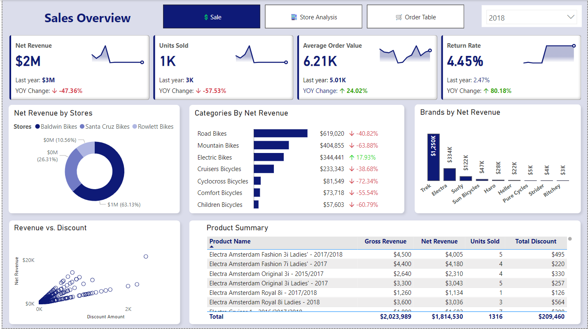
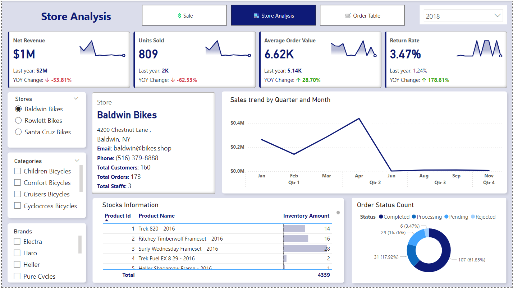
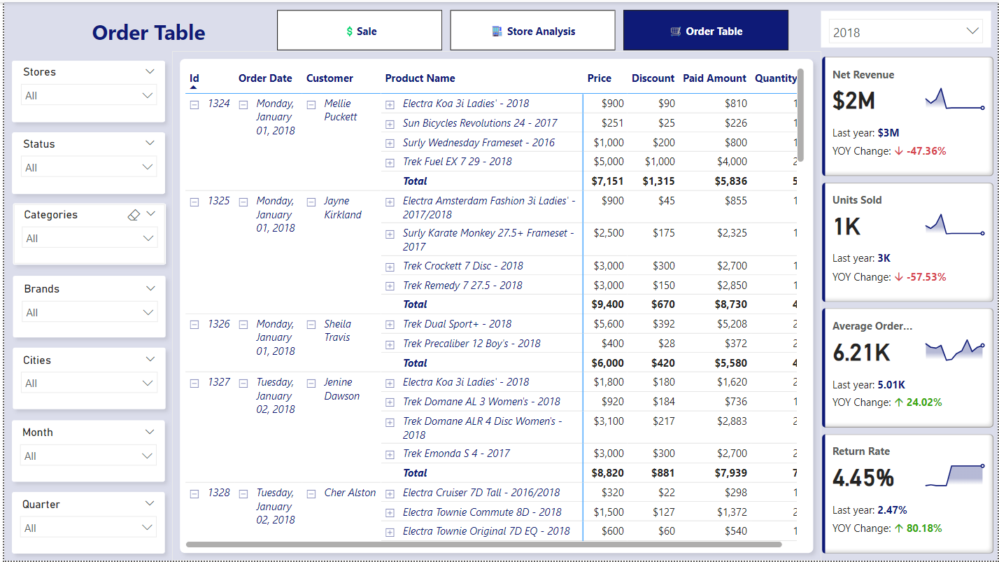

# 🚲 🏪 Bike Sales Performance Analysis with SQL and Power BI

This project leverages SQL and Power BI to analyze and visualize bike sales data. It focuses on key metrics such as order status distribution, average processing times, and sales trends over time. The analysis provides insights into customer purchasing behavior, product performance, and inventory management, helping to optimize sales strategies and operational efficiency.

## 🔨 Tools Used

- Python => is used for coverting csv files to sql files.
- PostgreSQL => is used to answer many important queries.
- PowerQuery => is used for creating measures and calculation for visuals.
- PowerBI => is used to create dashboard.

## 🗄️ Some of the important questions was solved by SQL Queries are:

1. List all customers along with their orders, including order status and order dates.
2. Find the total number of orders placed by each customer.
3. Retrieve the total sales for each product.
4. List all products that are currently out of stock.
5. Find the most popular product category based on the number of products sold.
6. Get a list of all completed orders along with the customer details and the total order amount.
7. List all staff members along with the store they work for.
8. Find the average list price of products for each brand.
9. Identify the top 3 customers based on the total amount spent on their orders.
10. Get a count of orders for each order status.
11. List all customers who have placed more than 2 orders.
12. Find the total number of products sold by each store.
13. Identify the top 5 best-selling products.
14. Retrieve all orders along with the total discount applied to each order.
15. List the products that have never been sold.
16. A function to retrieve the total sales for a given product ID.
17. A stored procedure that updates the quantity of a product in stock for a given product ID and store ID.
18. A stored procedure to get all orders for a given customer ID, including order details and total amount.
19. Retrieve the total sales for each product, along with the cumulative total sales up to the current row, ordered by total sales descending.
20. Calculate the running total of orders placed by each customer, ordered by order date.
21. Calculate the Rolling 7-Day Sales Total for Each Product.
22. Calculate the Year-to-Date Sales for Each Product.

## 📊 Interactive Dashboard

Interactive Dashboard is created for decision makers with popular business intelligence tool PowerBI. This dashboard has 3 pages with navigation system.

### 1. Sales Overview Page

### 2. Store Analysis

### 3. Order Table Page

